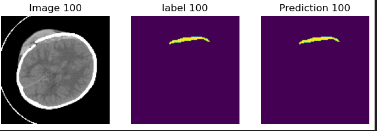

# ICH segmentation
Intracranial hemorrhage is an acute serious neurological conditions which require rapid diagnosis and intervention. Computed Tomography(CT) is an efficient and gold standard test to diagnose intracranial hemorrhage. Medically underserved areas often do not in house radiologists to read the CT scan in time. Thus, automatic diagnosis of these conditions can be beneficial. Here I presented a 2D Unet based segmentation model to segment intracranial hemorrhage lesions from a public available CT head dataset. The segmentation mask is then applied to original images to train a classification model, which classifies different types of intracranial hemorrhages. The dataset contains expert-annoted binary mask images and ground-truth labels for different type of hemorrhages. 

## Sample segmentation

## Classification result

| Hemorrhage Type          | Accuracy    |
| ------------------------ | ----------- |
| Intraventricular         | 99.64%      |
| Intraparenchymal         | 99.64%      |
| Subarachnoid             | 99.29%      |
| Epidural                 | 99.11%      |
| Subdural                 | 100.00%     |
| No_Hemorrhage            | 100.00%     |

The CT dataset is available publicly https://physionet.org/content/ct-ich/1.3.1/. 
